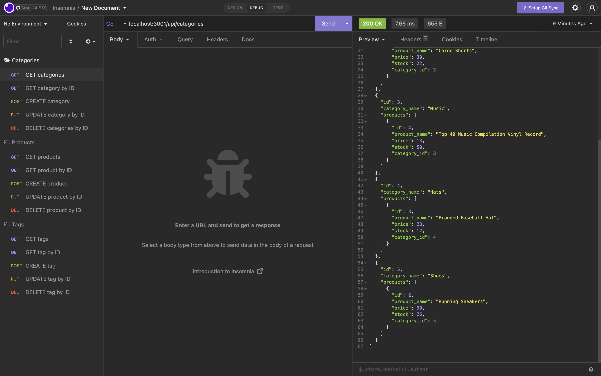
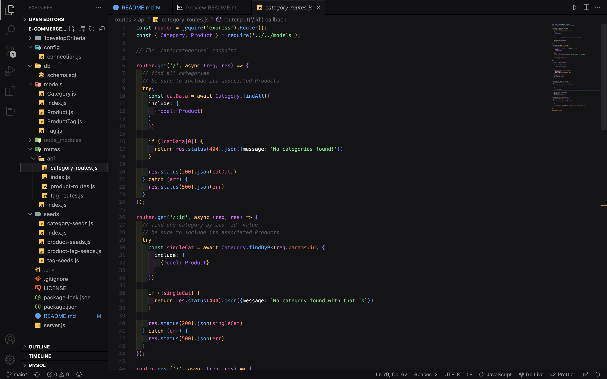

# E-Commerce-Store

## Table of Contents

* [Description](#description)
* [Usage](#usage)
* [Installation](#installation)
* [Credits](#credits)
* [License](#License)

## Description
I was challenged to create the backend for a mock ECommerce Giant. This included configuring the database, creating the tables within 
the database, filling them with information and then retrieving that information with custom API routes. 

Technologies I used to build the backend:

    JavaScript
    Node.js
    Express.js
    MySql
    Sequelize

### Examples of this program

>This is a picture demonstrating the program inside of Insomnia

>This picture is showing some of the code used to write the backend

## Usage

Make sure to create and seed your database before this step.
For instruction on how to do this, see 
[Installation](#installation)

First, run the server with this command:

    npm run start

Then, navigate over to Insomnia.

Here, you will use API routes defined in the *routes* folder
of the repo. This is all done using PORT 3001.

List of api routes

    localhost:3001/api/categories
    localhost:3001/api/categories/(id of desired category)
    localhost:3001/api/products
    localhost:3001/api/products/(id of desired product)
    localhost:3001/api/tags
    localhost:3001/api/tags/(id of desired tag)

Associated with each of these routes is each of the CRUD
operations. These include:

    GET
    POST
    PUT
    DELETE

Use these routes in conjunction with the CRUD operation
you'd like to perform to get your desired search results.

## Installation

>Insomnia, Node, and MySQL are required for this program.

First thing you must do is create the database in your local MySQL database. The command for this is:

Log into mysql shell using: 

    mysql -u root -p

Then enter:

    source db/schema.sql

This will create the database named ecommerce_db. Then you
will need to seed the database with information to be able 
to retrieve. 

The command for this is:

    npm run seed

This will seed the database with information for you to
retrieve using Insomnia and the API routes.

## Credits

University of Texas - Austin

[stackoverflow.com](https://stackoverflow.com)

[Sequelize Docs](https://sequelize.org/docs/v6/)

[MySQL Docs](https://dev.mysql.com/doc/)

## License

This repo is licensed under the MIT license.

For more info, please see [License](https://github.com/Opaleone/E-Commerce-Store/blob/main/LICENSE).